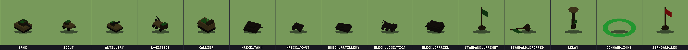

# More Firepower

**A deterministic, server-authoritative multiplayer wargame about *rescue* —
inspired by the 1987 Amiga classic *Firepower*, built as a new IP.**

You drop into a war that is already running — no lobby, no queue. Take a
tank, a scout, a mortar carrier, or the humble logistics truck, and fight
over the relay sites that project the supply lines both teams live on.
When your vehicle dies, your crew bails out and *walks*; teammates tow
your wreck home, carriers pick your operator up off the field, and the
war's primary objective is stealing the enemy's physical Command Standard
and escorting it all the way home. AI regents crew every empty seat, so
the world stays alive with one human or sixteen — and every war replays
**byte-exactly** from its command log.



> **Status:** playable and actively playtested · 422 automated tests ·
> 30+ tagged gameplay slices · two mirror-fair maps · English + Norsk.
> The defining experience — *recovery* — is in: downed operators, carrier
> rescue, tow-back repair, mines and mine-clearing, an anti-camping drone,
> direct tank control (the *Firepower* homage), fog ghosts, mission cards,
> replay viewer, and a living AI doctrine that tows, mines, rescues, and
> calls for help.

## Quick start

```bash
npm install
npm test          # the full contract — 422 tests, byte-exact fixtures
npm start         # http://localhost:8080 — pick a side, you're in the war
```

- `MAP=riverline npm start` — the second map: a river, three bridges.
- Press **G** in game for direct tank control (WASD), **⚙** for options
  (rescue autopilot, language), and see [`RUNNING.md`](RUNNING.md) for
  every key, LAN play, Docker, sims, and ops endpoints.
- Spectate or open `/replay.html` to scrub any archived war — the client
  re-simulates it locally, which is the engine's determinism made visible.

## What we're trying to build

Most multiplayer shooters reward the kill. This game's spec puts it
plainly: **the defining experience is recovery.** Towing a burning wreck
home under fire, carrying a downed teammate off the field, rebuilding a
shelled relay with a truckload of materiel — those verbs score higher
than kills and drive the whole design. The engine exists to make that
world *trustworthy*: one pure reducer owns every outcome, all state is
integer math, every war is a replayable artifact, and both maps are
mirror-symmetric **by tested invariant** so neither side ever wins on
geometry.

Where it's heading next (see [`plan-wave3.md`](plan-wave3.md)): two
asymmetric factions with unique units (a deployable Sentinel, an
amphibious Infiltrator), an NPC/POW layer, convoy escorts, full field
logistics, and a route graph so the AI drives like it means it.

## Drop in and contribute

The architecture was built for contributions that don't need to touch the
engine — each lane below is genuinely independent:

| Lane | What it looks like | Start here |
|---|---|---|
| **🎨 Art — painted models** | Every unit resolves through a manifest: drop a GLB next to its entry and it replaces the procedural stand-in with **zero code changes**. The strip above shows the current stand-ins begging for paint. | `assets/PIPELINE.md`, `client/assets/metadata/asset_manifest.json` |
| **🗺 Maps** | A map is a deterministic generator + a layout entry (relays, standard homes, patrols). The mirror-fairness test will fail you honestly if your map favors a side. | `engine/riverline.js` as the worked example, `MAP_LAYOUTS` in `engine/state.js`, `test/milestone11m.test.js` |
| **🌍 Translations** | Key-identical string catalogs; a parity test refuses half-translated UIs. English and Norsk ship today — a new language is one catalog. | `client/js/strings.js` |
| **⚖️ Playtesting & balance** | Run LAN wars, watch AI-vs-AI wars as a spectator, run seed sweeps (`node tools/sim_sweep.mjs 100`) and argue with the numbers. Open balance questions live in `reports/`. | `RUNNING.md`, `BATCH_PC.md`, `debugging/analyze_sweep.py` |
| **🔧 Engine & AI** | Pure-function slices with milestone tests; the AI regency is ordinary commands through the same reducer as humans. Open design questions are tracked with numbers. | `CLAUDE.md` (the working rules), `plan-wave3.md`, `reports/` |
| **📱 Platforms** | Mobile touch controls are designed (on-screen steering over the existing drive-intent command) and unbuilt. A Luau/Roblox engine twin is a stated long-term goal — the shared fixtures were built to prove that parity. | `plan-wave3.md` Track I |

**The one rule that protects everything:** `shared/` and `engine/` are
deterministic — no `Math.random`, no wall-clock, no floats, no I/O, no new
dependencies. Integer math (256 units per cell), pinned PRNG, canonical
serialization. `npm test` must be green **twice** before a PR; if you
change hashed state, the 1A fixture repin tool (`node tools/repin_1a.mjs
"<reason>"`) will walk you through it — and refuse if you broke the event
contract.

## Architecture in one paragraph

One pure reducer — `apply(state, command) → nextState` — owns every
outcome: movement (per-chassis headings and turn rates), combat, fog,
supply, capture countdowns, mines, drones, rescue, victory. `shared/`
holds canonical byte serialization, FNV-1a 64 hashing, and the seeded
PRNG; `engine/` holds the reducer, map profiles, LOS, AI regency, and the
headless `GameServer`; `server/` bridges it to WebSockets, static
hosting, rate limiting, and the replay store; `client/` renders
fog-filtered views with three.js and only ever *proposes* commands.
Tests are the contract: byte-exact fixtures pin the shared layer,
milestone tests pin every slice, and soak tests replay whole
32-participant wars hash-for-hash.

## Reading order

| File | What it tells you |
|---|---|
| [`RUNNING.md`](RUNNING.md) | how to run, test, and play — every key and mechanic |
| [`plan-version1.md`](plan-version1.md) / [`plan-version2.md`](plan-version2.md) | what shipped (v1: done) and the status board |
| [`plan-wave3.md`](plan-wave3.md) | the design-ahead plan: factions, NPCs, logistics, presentation |
| [`dev-log.md`](dev-log.md) | the slice-by-slice history — every tagged slice explained |
| [`CLAUDE.md`](CLAUDE.md) | working rules: determinism, slice workflow, fixture policy |
| `specs/` | the original design documents |
| `reports/` | session reports, playtest findings, open numbered questions |

## A note on `phases/` and `initial-prompt.md`

Those folders document the original prototype hand-off. The claims inside
("v0.7.0, feature-complete, 198 verified tests") describe an assembly
whose core engine layer was lost; the code there descends from a degraded
fork and is kept as design reference only. The rebuilt tree in this
repository root is the verified implementation — `dev-log.md`
marker-0001/0002 tells the full story.

## License

Not yet chosen — being decided alongside the art/asset licensing before
outside contributions are merged. Open an issue if this blocks you.
